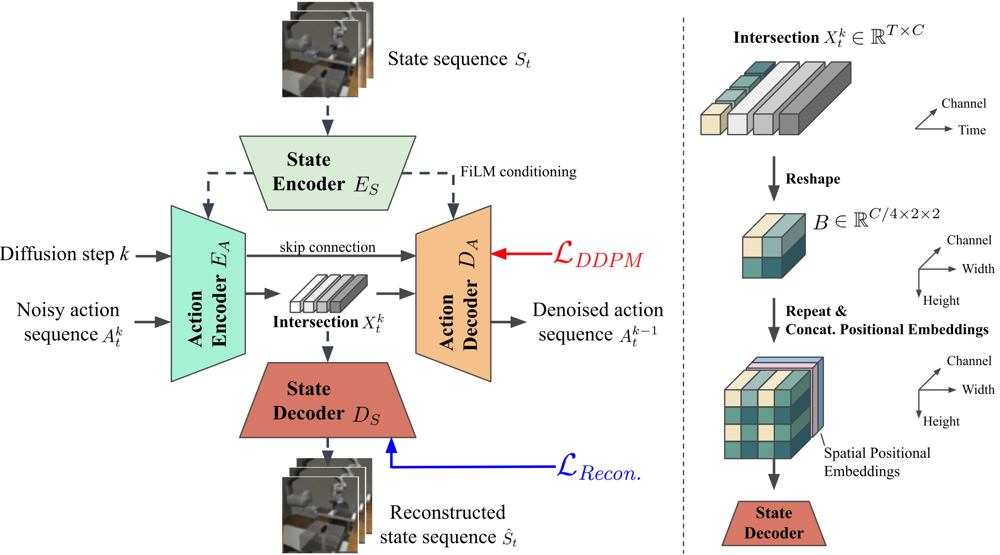
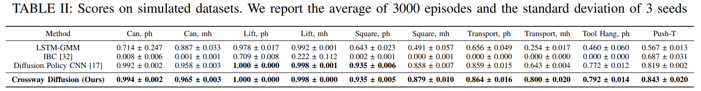
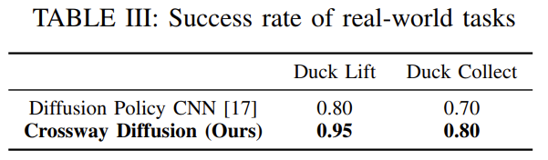

# Crossway Diffusion: Improving Diffusion-based Visuomotor Policy via Self-supervised Learning

This is the official implementation of our [ICRA'24](https://2024.ieee-icra.org/) paper [Crossway Diffusion: Improving Diffusion-based Visuomotor Policy via Self-supervised Learning](https://arxiv.org/abs/2307.01849). 

The code is adapted from [Diffusion Policy](https://github.com/real-stanford/diffusion_policy).

## News
- 7/1/2024, The 7 min presentation for ICRA'24 is online! [[Youtube](https://youtu.be/QESqudTVTkM)].
- 1/29/2024, [our paper](https://arxiv.org/abs/2307.01849) and the [attached video](https://youtu.be/9deKHueZBuk) have been aceepted to [ICRA'24](https://2024.ieee-icra.org/) 🎉.
- 1/12/2024, [a new version of our paper](https://arxiv.org/pdf/2307.01849v3.pdf) has been released.

## Presentation and Demo
Click the GIF below to watch the [full video](https://youtu.be/9deKHueZBuk)!

## Our Method

We propose *Crossway Diffusion*, a simple yet effective method to enhance diffusion-based visuomotor policy learning.

By introducing a carefully designed *state decoder* and a simple *reconstruction objective*, we explicitly regularize the intermediate representation of the diffusion model to capture the information of the input states, leading to enhanced performance across all datasets.

Our major contribution is included in:
1. [diffusion_policy/workspace/train_crossway_diffusion_unet_hybrid_workspace.py](diffusion_policy/workspace/train_crossway_diffusion_unet_hybrid_workspace.py) (newly added)
2. [diffusion_policy/policy/crossway_diffusion_unet_hybrid_image_policy.py](diffusion_policy/policy/crossway_diffusion_unet_hybrid_image_policy.py) (newly added)
3. [diffusion_policy/model/diffusion/conv2d_components.py](diffusion_policy/model/diffusion/conv2d_components.py) (newly added)
4. [diffusion_policy/model/diffusion/conditional_unet1d.py](diffusion_policy/model/diffusion/conditional_unet1d.py) (modified)

## Installation
The Python environment used in this project is identical to [Diffusion Policy](https://github.com/real-stanford/diffusion_policy). Please refer to [this link](https://github.com/real-stanford/diffusion_policy/blob/main/README.md) for detailed installation instructions.

(Optional) To manually control the image rendering device  through the environment variable `EGL_DEVICE_ID`, replace the original `robomimic/envs/env_robosuite.py` in `robomimic` with [this modified file](patch/env_robosuite.py).

## Download Datasets
Please follow the guide at [this link](https://github.com/columbia-ai-robotics/diffusion_policy/blob/main/README.md) to download the simulated datasets.

Our real-world datasets are available at [Hugging Face Dataset](https://huggingface.co/datasets/varunbel/crossway_ducks).
The dataset files have a similar structure as [robomimic](https://robomimic.github.io/docs/datasets/overview.html).
Please check [dataset_readme.md](dataset_readme.md) to train on our and your own datasets.

## Training
To train a model on simulated datasets with a specific random seed:

`EGL_DEVICE_ID=0 python train.py --config-dir=config/${task}/ --config-name=type[a-d].yaml training.seed=4[2-4]`

where `${EGL_DEVICE_ID}` defines which GPU is used for rendering simulated images, `${task}` can be `can_ph`, `can_mh`, `lift_ph`, `lift_mh`, `square_ph`, `square_mh`, `transport_ph`, `transport_mh`, `tool_hang_ph` and `pusht`.

The result will be stored at `outputs/` and `wandb/`. In our experiments, we use 42, 43 and 44 as the random seeds.

## Evaluation
To evaluate a checkpoint:

`EGL_DEVICE_ID=0 python eval.py --checkpoint <path to checkpoint.ckpt> --output_dir <path for output> --device cuda:0`

By default, the code will evaluate the model for 50 episodes and the results will be available at `<path for output>/eval_log.json`. 

## Pretrained Models
Our pretrained models and evaluation results are now available at [Hugging Face](https://huggingface.co/varunbel/crossway_diffusion).

## License
This repository is released under the MIT license. See [LICENSE](LICENSE) for additional details.
